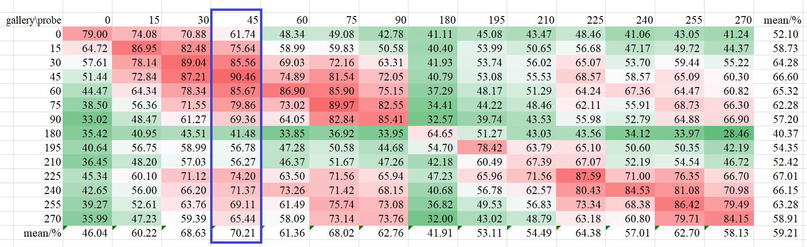

# AFA-GCN

Adaptive Fully Activated Graph Convolutional Network

# Coming soon

We are presently refining our code to enhance its readability and comprehensibility for other researchers. We anticipate to share our code in July, after we complete the refinement process and ascertain its quality and functionality.

# Computational cost analysis

Apart from accuracy, speed is also a crucial factor for practical gait recognition, which is always neglected in previous literature. In this section, we compare the computational cost of different methods, including pre-processing and model inference.

The CASIA-B dataset focuses on the effect of factors other than human detection or segmentation, simple background was used to simplify silhouette segmentation. However, in the real world, it is necessary to use deep learning to extract silhouettes from complex outdoor environments. So, we refer to the recent gait dataset named Gait Recognition in the Wild (GREW) and silhouettes are produced by segmenting the foreground human body utilizing HTC algorithm with a single 3090Ti GPU. As shown in Table 1, for a sequence with 60 frames on CASIA-B dataset, pre-processing (i.e. detection, segmentation, pose estimation et al.) takes most of the time while model inference is relatively faster. Parameters of gait networks are also calculated for comparison.

In general, the computational cost of extracting skeletons has been greatly reduced due to advances in pose estimation. For feature representation in the real world, it is not a large gap in computational cost between model-based method and appearance-based one. Due to the low dimension of the input, our method is significantly faster than the appearance-based one in the inference phase.

Table 1. Pre-processing, Inference Time and Parameters of Both Appearance-based Methods and Model-based One.

| Methods                            | Preprocessing/s | Inference/s | Total/s *           | Parameters/M      |
|------------------------------------|-----------------|-------------|---------------------|-------------------|
| GaitSet      | 338.63          | 23.34       | 361.97 $\uparrow$   | 6.31 $\uparrow$   |
| GaitPart     | 338.63          | 65.46       | 404.09 $\uparrow$   | 6.01 $\uparrow$   |
| PoseGait       | 301.27          | 7.24        | 308.51 $\downarrow$ | 7.74 $\uparrow$   |
| GaitGraph | 352.70          | 8.23        | 360.93 $\uparrow$   | 0.53 $\downarrow$ |
| our method (1s)                    | 140.69          | 6.60        | 147.29 $\downarrow$ | 0.40 $\downarrow$ |
| our method (2s)                    | 140.69          | 12.38       | 153.07 $\downarrow$ | 0.85 $\downarrow$ |
| our method (3s)                    | 140.69          | 22.19       | 162.88 $-$          | 1.27 $-$          |

# Performance on OUMVLP-Pose dateset

The picture shown below is the full table, which includes all combinations of probe and gallery on the AlphaPose dataset. The blue box contains the columns where the probe is under 45&deg; and it achieves the highest accuracy among all angles.

    
     
    
The full table includes all combinations of probe and gallery on AlphaPose dataset

<!--  -->
